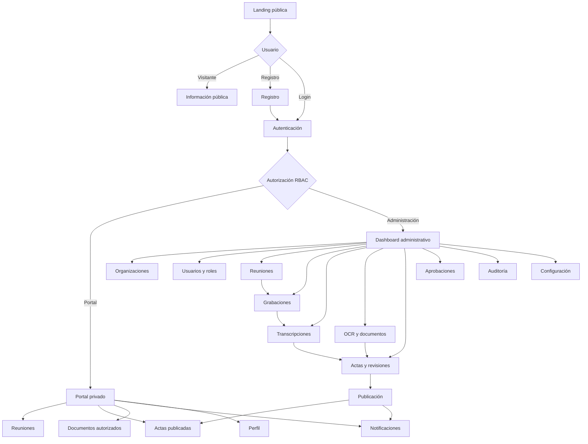
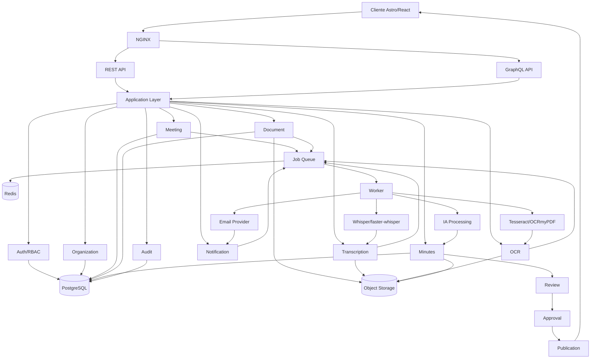
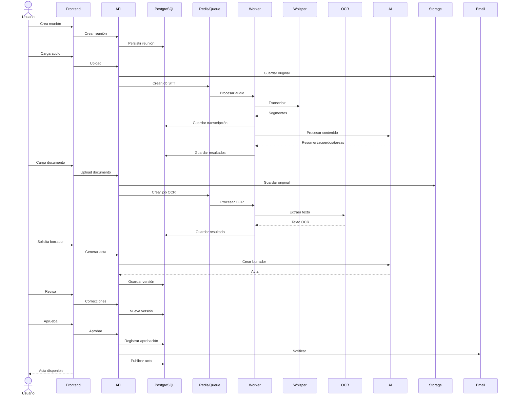

# PRD — Plataforma de Gestión, Transcripción y Documentación de Reuniones

**Nombre provisional:** ReunionAI  
**Versión:** 1.0.0  
**Estado:** Aprobado para diseño y desarrollo  
**Jurisdicción inicial:** Colombia  
**Arquitectura:** Monolito modular + REST + GraphQL + PostgreSQL + Redis opcional + Docker  
**Frontend:** Astro + React + TypeScript + Tailwind CSS  
**Speech-to-Text inicial:** Whisper / faster-whisper  
**OCR inicial:** Tesseract + OCRmyPDF, mediante adaptadores intercambiables

---

## 1. Resumen ejecutivo

ReunionAI será una plataforma multi-tenant para gestionar reuniones formales, grabaciones, documentos, transcripciones, actas, aprobaciones, publicaciones y notificaciones.

El producto estará orientado inicialmente a:

- Propiedad horizontal.
- Conjuntos residenciales.
- Edificios.
- Administradoras de propiedad horizontal.
- Fundaciones con o sin ánimo de lucro.
- Sociedades.
- Juntas administrativas.
- Juntas directivas.
- Reuniones ordinarias y extraordinarias.
- Otros tipos de organizaciones que requieran documentación formal de reuniones.

La plataforma tendrá dos capacidades de procesamiento principales:

1. **Speech-to-Text:** convertir grabaciones de reuniones en transcripciones.
2. **OCR:** convertir documentos escaneados o imágenes en texto estructurado.

La IA podrá generar borradores de actas, resúmenes, decisiones, acuerdos, tareas, responsables y fechas. La publicación definitiva requerirá revisión y aprobación de usuarios autorizados.

La arquitectura permitirá cambiar posteriormente los motores de OCR y Speech-to-Text sin modificar los módulos de negocio.

---

# 2. Problema

Las organizaciones que celebran reuniones formales suelen manejar información distribuida entre:

- grabaciones;
- documentos físicos;
- fotografías de documentos;
- archivos PDF;
- correos;
- mensajes;
- hojas de cálculo;
- actas;
- documentos firmados.

Esto dificulta:

- elaborar actas;
- conservar trazabilidad;
- consultar reuniones anteriores;
- controlar versiones;
- demostrar quién modificó o aprobó información;
- distribuir documentación;
- proteger información según el rol del usuario.

ReunionAI centralizará estos procesos.

---

# 3. Visión

Crear una plataforma que permita registrar una reunión, procesar automáticamente su contenido, generar documentación estructurada, someterla a revisión humana, aprobarla y distribuirla de manera controlada.

La primera implementación utilizará propiedad horizontal como caso demostrativo, pero la arquitectura será sectorialmente agnóstica.

---

# 4. Objetivos

## 4.1 Objetivos funcionales

- Registrar organizaciones.
- Gestionar usuarios.
- Gestionar roles y permisos.
- Registrar reuniones.
- Grabar o cargar audio.
- Transcribir audio.
- Procesar documentos mediante OCR.
- Conservar originales y versiones procesadas.
- Generar borradores de actas.
- Permitir revisión humana.
- Aprobar actas.
- Publicar documentación.
- Notificar por correo electrónico.
- Proporcionar portal privado.
- Mantener auditoría.
- Controlar acceso por tenant.
- Permitir roles personalizados.
- Preparar adaptadores para WhatsApp y Telegram.

## 4.2 Objetivos técnicos

- Arquitectura modular.
- API REST.
- API GraphQL.
- PostgreSQL.
- Redis solamente cuando exista necesidad real.
- Procesamiento asíncrono para tareas pesadas.
- Docker.
- CI/CD con GitHub Actions.
- Testing automatizado.
- Observabilidad.
- Versionado documental.
- Seguridad por defecto.

---

# 5. Alcance del MVP

## Incluido

- Multi-tenancy.
- Autenticación.
- RBAC.
- Roles personalizados.
- MFA/2FA.
- Organizaciones.
- Usuarios.
- Reuniones.
- Carga de audio.
- Whisper/faster-whisper.
- Transcripciones.
- OCR.
- PDF, JPG, JPEG, PNG y TIFF.
- Documentos multipágina.
- Generación de borradores.
- Revisión.
- Aprobación.
- Actas.
- Publicación privada.
- Email.
- Auditoría.
- Dashboard.
- Landing configurable.
- Portal de copropietarios/residentes.
- Docker.
- PostgreSQL.
- Redis opcional.
- REST.
- GraphQL.

## Preparado, pero fuera del MVP

- WhatsApp.
- Telegram.
- Proveedores externos de Speech-to-Text.
- Proveedores externos de OCR.
- Multi-jurisdicción.
- Firma electrónica avanzada.
- Aplicaciones móviles nativas.
- Automatizaciones avanzadas.

---

# 6. Modelo multi-tenant

La jerarquía inicial será:

```text
Platform
└── Organization
    ├── Property / Group
    ├── Users
    ├── Roles
    ├── Meetings
    ├── Documents
    ├── Transcriptions
    ├── Minutes
    ├── Notifications
    └── Audit Events
```

Una organización podrá representar:

- conjunto;
- edificio;
- fundación;
- sociedad;
- administradora;
- junta;
- organización personalizada.

El modelo deberá evitar acoplar reglas de negocio a un único tipo de organización.

---

# 7. Usuarios

Roles base:

- Super Admin.
- Organization Admin.
- Property Admin.
- President.
- Secretary.
- Board Member.
- Reviewer.
- Co-owner.
- Resident.
- Guest.

Las organizaciones podrán crear roles personalizados.

---

# 8. RBAC

Los permisos deberán utilizar recursos y acciones.

Ejemplo conceptual:

```text
resource: meeting
actions:
  create
  read
  update
  delete
  publish
  approve
  export
```

El sistema deberá soportar:

- roles;
- permisos;
- asignaciones por tenant;
- permisos personalizados;
- restricciones por recurso;
- separación de privilegios.

El backend nunca confiará únicamente en las restricciones del frontend.

---

# 9. Seguridad

## Requisitos

- Contraseñas almacenadas mediante algoritmo de hashing seguro.
- Tokens de acceso con expiración.
- Refresh tokens con rotación.
- MFA/2FA.
- Control de sesiones.
- Rate limiting.
- Validación de entrada.
- Protección contra IDOR.
- Protección contra escalamiento horizontal de privilegios.
- Protección contra escalamiento vertical de privilegios.
- CORS controlado.
- CSRF cuando aplique.
- Content Security Policy.
- Headers de seguridad.
- Cifrado en tránsito.
- Cifrado de almacenamiento cuando la infraestructura lo permita.
- URLs temporales para archivos privados.
- Auditoría.

---

# 10. Auditoría

Se registrarán eventos relevantes:

- login;
- logout;
- cambio de contraseña;
- MFA;
- creación;
- modificación;
- eliminación;
- acceso a documentos;
- descarga;
- creación de transcripción;
- modificación de transcripción;
- creación de acta;
- revisión;
- aprobación;
- publicación;
- cambios de permisos.

Cada evento deberá almacenar como mínimo:

```text
actor
tenant
action
resource
resource_id
timestamp
ip
user_agent
metadata
```

Los eventos de auditoría no deberán modificarse desde la interfaz normal.

---

# 11. Gestión de reuniones

Una reunión tendrá:

- organización;
- tipo;
- título;
- descripción;
- fecha;
- hora;
- ubicación;
- modalidad;
- convocatoria;
- participantes;
- asistentes;
- audio;
- documentos asociados;
- transcripción;
- borrador;
- acta;
- decisiones;
- tareas;
- estado.

Estados sugeridos:

```text
scheduled
recording
processing
transcribed
draft
review
approved
published
archived
```

---

# 12. Speech-to-Text

## Motor inicial

Whisper / faster-whisper.

## Arquitectura

El módulo deberá definir una interfaz:

```text
SpeechToTextProvider
├── transcribe()
├── detect_language()
├── timestamps()
└── diarization_support()
```

Implementación inicial:

```text
FasterWhisperProvider
```

Futuros adaptadores:

```text
OpenAIProvider
GoogleProvider
AzureProvider
DeepgramProvider
WhisperCppProvider
```

El dominio no deberá depender directamente de un proveedor.

---

# 13. Diarización

La plataforma deberá permitir identificar segmentos por hablante cuando el procesamiento utilizado lo soporte.

Modelo conceptual:

```text
Speaker 01
00:00:03 → 00:00:17

Speaker 02
00:00:18 → 00:00:31
```

La identificación nominal podrá realizarse durante una etapa de revisión.

---

# 14. Procesamiento IA

La plataforma podrá producir:

- resumen;
- puntos tratados;
- decisiones;
- acuerdos;
- tareas;
- responsables;
- fechas;
- asuntos pendientes;
- preguntas;
- temas para próxima reunión.

El contenido generado será un **borrador asistido**, no una declaración automática de hechos jurídicos.

---

# 15. Generación de actas

El proceso será:

```text
Transcripción
+
Documentos
+
Metadatos de reunión
+
Participantes
        ↓
Procesamiento
        ↓
Borrador de acta
        ↓
Revisión humana
        ↓
Correcciones
        ↓
Aprobación
        ↓
Publicación
```

El sistema deberá conservar:

- transcripción original;
- transcripción corregida;
- borrador;
- versiones;
- acta aprobada;
- fecha de aprobación;
- usuario aprobador.

---

# 16. OCR

## Formatos MVP

- PDF.
- JPG.
- JPEG.
- PNG.
- TIFF.

## Pipeline

```text
Upload
 ↓
Virus/Malware Scan
 ↓
Document Validation
 ↓
OCR
 ↓
Text Extraction
 ↓
Quality Check
 ↓
Human Correction
 ↓
Processed Document
```

Implementación inicial:

- Tesseract.
- OCRmyPDF.

El módulo deberá usar una interfaz:

```text
OCRProvider
├── process()
├── extract_text()
└── confidence()
```

---

# 17. Trazabilidad documental

Cada documento deberá conservar:

```text
original
ocr_result
corrected_text
final_document
versions
audit_history
```

Nunca se deberá sobrescribir silenciosamente el documento original.

---

# 18. Almacenamiento

PostgreSQL almacenará metadatos.

Los archivos binarios deberán almacenarse mediante almacenamiento de objetos o volumen dedicado.

Estructura conceptual:

```text
storage/
  tenants/
    {tenant_id}/
      meetings/
      documents/
      recordings/
      transcripts/
      minutes/
```

El sistema deberá poder migrar posteriormente hacia S3-compatible storage sin rediseñar el dominio.

---

# 19. Email

El MVP tendrá email.

Casos:

- invitaciones;
- recuperación de cuenta;
- notificaciones;
- actas publicadas;
- documentos disponibles;
- solicitudes de revisión;
- aprobación;
- alertas administrativas.

Se recomienda una interfaz:

```text
NotificationProvider
```

Implementación MVP:

```text
EmailProvider
```

Futuros:

```text
WhatsAppProvider
TelegramProvider
```

---

# 20. Portal privado

Los copropietarios/residentes podrán:

- registrarse;
- iniciar sesión;
- consultar información autorizada;
- consultar actas publicadas;
- consultar documentos;
- descargar archivos según permisos;
- consultar reuniones;
- recibir notificaciones;
- actualizar perfil.

El contenido privado nunca deberá depender de que una ruta sea simplemente "oculta".

---

# 21. Landing page

La landing deberá ser configurable por organización.

Secciones:

- Inicio.
- Nosotros / Quiénes somos.
- Servicios.
- Cómo funciona.
- Reuniones.
- Documentos.
- Actas.
- Galería.
- Preguntas frecuentes.
- Contacto.
- Registro.
- Inicio de sesión.

Datos iniciales:

- dummy;
- Lorem ipsum;
- imágenes placeholder;
- información configurable.

---

# 22. Dashboard

## Dashboard general

Indicadores:

- reuniones;
- reuniones pendientes;
- transcripciones;
- documentos;
- OCR pendientes;
- actas en revisión;
- actas aprobadas;
- actas publicadas;
- tareas pendientes.

## Gestión de reuniones

- calendario;
- listado;
- filtros;
- detalle;
- participantes;
- archivos;
- transcripción;
- acta.

## Gestión documental

- carga;
- OCR;
- búsqueda;
- versiones;
- permisos;
- descarga.

## Administración

- organizaciones;
- usuarios;
- roles;
- permisos;
- configuración;
- auditoría.

---

# 23. Búsqueda

La plataforma deberá permitir búsqueda sobre:

- reuniones;
- actas;
- documentos;
- transcripciones;
- participantes;
- acuerdos;
- tareas.

PostgreSQL podrá utilizar búsqueda de texto inicialmente.

La búsqueda semántica/vectorial se considerará para una fase posterior.

---

# 24. REST API

REST será utilizado para operaciones CRUD, autenticación, archivos, procesos y acciones explícitas.

Rutas conceptuales:

```text
/api/v1/auth
/api/v1/users
/api/v1/organizations
/api/v1/roles
/api/v1/permissions
/api/v1/meetings
/api/v1/recordings
/api/v1/transcriptions
/api/v1/documents
/api/v1/ocr
/api/v1/minutes
/api/v1/reviews
/api/v1/approvals
/api/v1/notifications
/api/v1/audit
```

Debe existir versionado de API.

---

# 25. GraphQL

GraphQL será complementario a REST.

Casos apropiados:

- dashboard;
- consultas con múltiples relaciones;
- búsquedas complejas;
- vistas agregadas;
- portal.

No deberá utilizarse para reemplazar operaciones de archivos grandes.

---

# 26. Redis

Redis no será obligatorio para todo flujo.

Se utilizará cuando aporte valor para:

- colas ligeras;
- cache;
- sesiones cuando corresponda;
- rate limiting;
- estado temporal de trabajos.

Los procesos pesados deberán poder evolucionar hacia un sistema de workers/colas dedicado.

---

# 27. Procesamiento asíncrono

Las tareas potencialmente largas no deberán bloquear solicitudes HTTP:

- OCR;
- transcripción;
- diarización;
- generación de documentos;
- generación de resúmenes;
- envío masivo de email.

Estados:

```text
queued
processing
completed
failed
cancelled
```

---

# 28. Backend

La selección inicial recomendada para el MVP será:

**Python + FastAPI**

Razones:

- ecosistema sólido para Speech-to-Text;
- integración natural con Whisper/faster-whisper;
- OCR;
- procesamiento de documentos;
- workers;
- APIs;
- tipado mediante Pydantic.

La arquitectura deberá mantener separación suficiente para que componentes Node.js puedan incorporarse posteriormente si existe una necesidad concreta.

Módulos:

```text
auth
users
organizations
properties
rbac
meetings
recordings
transcription
ocr
documents
minutes
reviews
approvals
notifications
audit
search
administration
```

---

# 29. Base de datos

PostgreSQL será la base principal.

Entidades iniciales:

```text
tenants
organizations
properties
users
roles
permissions
role_permissions
user_roles
meetings
meeting_participants
recordings
transcriptions
transcription_segments
speakers
documents
document_versions
ocr_jobs
minutes
minute_versions
reviews
approvals
tasks
notifications
audit_events
sessions
```

Todas las tablas que contengan información de tenant deberán tener `tenant_id` cuando corresponda.

---

# 30. Integridad multi-tenant

Cada consulta deberá aplicar contexto de tenant.

Se evaluará el uso de:

- service-layer enforcement;
- repository enforcement;
- PostgreSQL Row Level Security para módulos apropiados.

No deberá existir acceso directo desde el cliente a PostgreSQL.

---

# 31. Docker

Servicios MVP:

```text
frontend
backend
postgres
redis
worker
nginx
```

Redis será opcional según la implementación final de colas/cache.

Whisper/OCR deberán poder ejecutarse como workers separados si la carga lo requiere.

---

# 32. CI/CD

GitHub Actions:

```text
lint
 ↓
type/static checks
 ↓
unit tests
 ↓
integration tests
 ↓
security checks
 ↓
build
 ↓
container scan
 ↓
artifact
 ↓
deployment
```

Ambientes:

```text
development
staging
production
```

---

# 33. Testing

Se requiere:

- unit tests;
- integration tests;
- API tests;
- authorization tests;
- tenant isolation tests;
- OCR tests;
- transcription pipeline tests;
- frontend tests;
- E2E;
- security tests.

Especial atención:

```text
Tenant A must never access Tenant B.
```

---

# 34. Observabilidad

Registrar:

- logs estructurados;
- errores;
- duración de jobs;
- estado de workers;
- uso de almacenamiento;
- tiempo de transcripción;
- tiempo de OCR;
- errores por proveedor;
- métricas de API.

Preparado para:

- OpenTelemetry;
- Prometheus;
- Grafana;
- Sentry o equivalente.

---

# 35. Privacidad

El producto deberá diseñarse bajo principios de:

- minimización;
- control de acceso;
- trazabilidad;
- retención configurable;
- eliminación controlada;
- exportación;
- protección de archivos.

Para Colombia deberán revisarse las obligaciones aplicables a protección de datos personales y documentación societaria/administrativa antes de definir políticas legales definitivas.

El software no deberá presentarse como sustituto de asesoría jurídica.

---

# 36. Jurisdicciones

Colombia será la primera jurisdicción.

Las reglas deberán diseñarse como configuración/módulos:

```text
jurisdiction
 ├── Colombia
 ├── Country B
 └── Country C
```

No se deberán codificar requisitos legales de Colombia directamente en componentes genéricos.

---

# 37. Roadmap

## V1 — MVP

- multi-tenant;
- auth;
- RBAC;
- reuniones;
- audio;
- Whisper;
- OCR;
- documentos;
- actas;
- revisión;
- aprobación;
- portal;
- email;
- auditoría.

## V2

- WhatsApp;
- Telegram;
- proveedores STT externos;
- proveedores OCR externos;
- búsqueda semántica;
- firma electrónica;
- automatizaciones;
- calendario avanzado.

## V3

- multi-jurisdicción;
- aplicación móvil;
- analítica avanzada;
- IA especializada por tipo de organización;
- clasificación documental avanzada;
- flujos legales configurables.

---

# 38. Criterios de aceptación principales

1. Un tenant no puede consultar información de otro tenant.
2. Un usuario solamente puede ejecutar acciones permitidas por su rol.
3. Un audio puede ser procesado y producir una transcripción persistente.
4. Un documento escaneado puede ser procesado mediante OCR.
5. Los originales no son sobrescritos.
6. Las transcripciones mantienen versiones.
7. Un acta requiere revisión antes de publicación.
8. La aprobación queda auditada.
9. La publicación genera una notificación.
10. El portal solamente muestra información autorizada.
11. REST funciona para las operaciones definidas.
12. GraphQL funciona para consultas definidas.
13. Los jobs largos son asíncronos.
14. El proveedor STT puede sustituirse mediante un adaptador.
15. El proveedor OCR puede sustituirse mediante un adaptador.
16. Docker permite levantar el entorno.
17. CI ejecuta las pruebas.
18. Las acciones críticas quedan registradas.

---

# 39. Definition of Done

Una funcionalidad solamente se considera terminada cuando:

- está implementada;
- tiene tests;
- tiene validaciones;
- respeta RBAC;
- respeta aislamiento de tenant;
- tiene documentación;
- tiene migraciones cuando corresponda;
- tiene logs;
- maneja errores;
- pasa revisión;
- pasa RDD;
- pasa Judgment Day cuando corresponda;
- no introduce regresiones.

---

# 40. Riesgos

- Coste de procesamiento de audio.
- Requisitos de hardware para Whisper.
- Calidad variable del audio.
- Calidad variable del OCR.
- identificación incorrecta de hablantes.
- errores en contenido generado por IA.
- información confidencial.
- crecimiento del almacenamiento.
- complejidad de multi-tenancy.
- requisitos legales variables por jurisdicción.

El sistema deberá tratar cualquier resultado generado automáticamente como contenido sujeto a revisión.

---

# 41. Decisiones arquitectónicas definitivas

| Área | Decisión |
|---|---|
| Arquitectura | Monolito modular |
| API | REST + GraphQL |
| Backend | Python + FastAPI |
| Frontend | Astro + React |
| Lenguaje frontend | TypeScript |
| CSS | Tailwind CSS |
| DB | PostgreSQL |
| Cache/colas | Redis cuando sea necesario |
| STT inicial | Whisper / faster-whisper |
| OCR inicial | Tesseract + OCRmyPDF |
| Storage | Object storage/volumen dedicado |
| Auth | RBAC + MFA/2FA |
| Multi-tenant | Sí |
| Roles personalizados | Sí |
| Auditoría | Sí |
| Versionado | Sí |
| Email | MVP |
| WhatsApp | V2 |
| Telegram | V2 |
| Docker | Sí |
| CI/CD | GitHub Actions |
| Jurisdicción inicial | Colombia |
| Multi-jurisdicción | Roadmap |

---

# 42. Flujo frontend



# 43. Flujo backend



---

# 44. Flujo completo del producto


