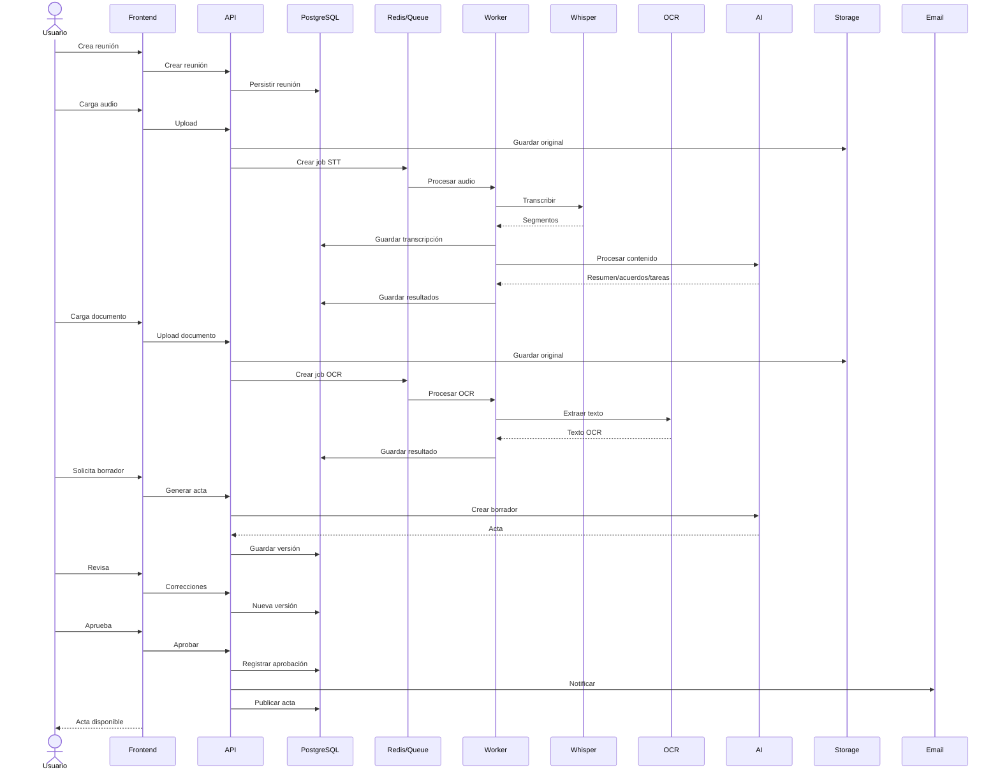

# ReunionAI — Administration-MeetingAI

<!-- badges:start --><p align="center">
  <a href="https://github.com/Gentleman-Programming/gentle-ai">
    
  </a>
</p>

<p align="center">                </p>
<!-- badges:end -->

**[Español](#español) · [English](#english)**

---

## Español

Plataforma **multi-tenant** para gestionar reuniones formales, grabaciones, documentos, transcripciones, actas, aprobaciones, publicaciones y notificaciones. Orientada inicialmente a propiedad horizontal en Colombia, con arquitectura agnóstica de sector preparada para fundaciones, sociedades, juntas y otras organizaciones.

### Capacidades principales

- **Speech-to-Text:** grabaciones de reuniones → transcripciones (Whisper / faster-whisper).
- **OCR:** documentos escaneados o imágenes → texto estructurado (Tesseract + OCRmyPDF).
- **Actas asistidas por IA:** borradores con resumen, decisiones, acuerdos y tareas — siempre sujetos a revisión y aprobación humana antes de publicarse.
- **RBAC + MFA/2FA, auditoría completa y aislamiento de tenant:** ningún tenant puede acceder a datos de otro.
- **Portal privado, landing configurable y notificaciones por email** (WhatsApp/Telegram preparados para V2).

### Stack

| Capa | Tecnología |
| --- | --- |
| Frontend | Astro + React + TypeScript + Tailwind CSS |
| Backend | Python + FastAPI + Pydantic (monolito modular) |
| API | REST (`/api/v1/`) + GraphQL |
| Base de datos | PostgreSQL |
| Cache/colas | Redis (opcional, donde aporte valor) |
| Infraestructura | Docker + Docker Compose + NGINX |
| CI/CD | GitHub Actions |

Los proveedores (STT, OCR, notificaciones, storage, IA) se acceden mediante interfaces intercambiables: el dominio nunca depende de un SDK específico.

### Flujo completo del producto



Más diagramas (flujo frontend, flujo backend, flujos del agente): **[docs/diagrams/](docs/diagrams/README.md)**.

### Documentación

| Documento | Descripción |
| --- | --- |
| [PRD-ReunionAI.md](PRD-ReunionAI.md) | Product Requirements Document (español, fuente autoritativa del producto) |
| [gentle-meeting-documentation-agent.md](gentle-meeting-documentation-agent.md) | Especificación completa del agente de desarrollo |
| [AGENTS.md](AGENTS.md) | Contrato del agente en inglés (reglas, stack, autonomía, Definition of Done) |
| [.agents/skills/](.agents/skills/) | Skills del agente: SDD, TDD, seguridad multi-tenant, RDD/reviewers, Judgment Day, reportes |
| [docs/diagrams/](docs/diagrams/README.md) | Diagramas Mermaid extraídos del PRD y del spec del agente |

### Desarrollo

El desarrollo sigue el ciclo **Research → SDD → TDD → RDD → Judgment Day → Review → Docs**, orquestado por el agente según `AGENTS.md`. Orden de prioridad innegociable:

```text
Correctness > Security > Tenant Isolation > Traceability > Testability
> Maintainability > Performance > Convenience
```

[Versioning policy](docs/development/versioning.md)

Entorno local:

```bash
cp .env.example .env          # configurar variables (JWT keys, DB, rate limits)
docker compose up -d          # frontend (:8081), backend, postgres, nginx
```

Desarrollo sin Docker:

```bash
# Backend (Python 3.11+)
cd apps/backend
python -m venv .venv && .venv/bin/pip install -e '.[dev]'
# DB de tests (una vez):
docker run -d --name reunionai-test-pg -e POSTGRES_USER=reunionai \
  -e POSTGRES_PASSWORD=reunionai -e POSTGRES_DB=reunionai -p 5433:5432 postgres:16-alpine
.venv/bin/ruff check . && .venv/bin/mypy app && .venv/bin/pytest

# Frontend (pnpm)
cd apps/frontend
pnpm install && pnpm vitest run && pnpm dev
```

Bootstrap del primer super-admin de plataforma:

```bash
cd apps/backend
.venv/bin/python -m app.cli bootstrap-superadmin \
  --email admin@ejemplo.com --password <secreto> --full-name "Admin"
# o dentro de Docker: docker compose exec backend python -m app.cli bootstrap-superadmin ...
```

CI: `.github/workflows/ci.yml` corre lint + typecheck + tests + build en cada push/PR.

---

## English

**Multi-tenant** platform for managing formal meetings, recordings, documents, transcriptions, minutes, approvals, publications, and notifications. Initially targets homeowners associations in Colombia, with a sector-agnostic architecture ready for foundations, corporations, boards, and other organizations.

### Core capabilities

- **Speech-to-Text:** meeting recordings → transcripts (Whisper / faster-whisper).
- **OCR:** scanned documents and images → structured text (Tesseract + OCRmyPDF).
- **AI-assisted minutes:** drafts with summaries, decisions, agreements, and tasks — always subject to human review and approval before publication.
- **RBAC + MFA/2FA, full audit trail, and tenant isolation:** one tenant can never access another tenant's data.
- **Private portal, configurable landing page, and email notifications** (WhatsApp/Telegram adapters prepared for V2).

### Stack

| Layer | Technology |
| --- | --- |
| Frontend | Astro + React + TypeScript + Tailwind CSS |
| Backend | Python + FastAPI + Pydantic (modular monolith) |
| API | REST (`/api/v1/`) + GraphQL |
| Database | PostgreSQL |
| Cache/queues | Redis (optional, where it adds value) |
| Infrastructure | Docker + Docker Compose + NGINX |
| CI/CD | GitHub Actions |

All providers (STT, OCR, notifications, storage, AI) are accessed through interchangeable interfaces: the domain never depends on a specific SDK.

### Full product flow

See the sequence diagram above (Spanish section). All diagrams — including frontend flow, backend flow, and the agent workflows — live in **[docs/diagrams/](docs/diagrams/README.md)**.

### Documentation

| Document | Description |
| --- | --- |
| [PRD-ReunionAI.md](PRD-ReunionAI.md) | Product Requirements Document (Spanish, authoritative product source) |
| [gentle-meeting-documentation-agent.md](gentle-meeting-documentation-agent.md) | Full development-agent specification |
| [AGENTS.md](AGENTS.md) | Agent contract in English (rules, stack, autonomy, Definition of Done) |
| [.agents/skills/](.agents/skills/) | Agent skills: SDD, TDD, multi-tenant security, RDD/reviewers, Judgment Day, reporting |
| [docs/diagrams/](docs/diagrams/README.md) | Mermaid diagrams extracted from the PRD and the agent spec |

### Development

Work follows the **Research → SDD → TDD → RDD → Judgment Day → Review → Docs** cycle, orchestrated by the agent per `AGENTS.md`. Non-negotiable priority order:

```text
Correctness > Security > Tenant Isolation > Traceability > Testability
> Maintainability > Performance > Convenience
```

Local environment:

```bash
cp .env.example .env          # configure variables (JWT keys, DB, rate limits)
docker compose up -d          # frontend (:8081), backend, postgres, nginx
```

Development without Docker:

```bash
# Backend (Python 3.11+)
cd apps/backend
python -m venv .venv && .venv/bin/pip install -e '.[dev]'
docker run -d --name reunionai-test-pg -e POSTGRES_USER=reunionai \
  -e POSTGRES_PASSWORD=reunionai -e POSTGRES_DB=reunionai -p 5433:5432 postgres:16-alpine
.venv/bin/ruff check . && .venv/bin/mypy app && .venv/bin/pytest

# Frontend (pnpm)
cd apps/frontend
pnpm install && pnpm vitest run && pnpm dev
```

Bootstrap the first platform super-admin:

```bash
cd apps/backend
.venv/bin/python -m app.cli bootstrap-superadmin \
  --email admin@example.com --password <secret> --full-name "Admin"
```

CI: `.github/workflows/ci.yml` runs lint + typecheck + tests + build on every push/PR.

---

> This software is not a substitute for legal advice. All AI-generated content is a draft subject to human review. / Este software no sustituye asesoría jurídica. Todo contenido generado por IA es un borrador sujeto a revisión humana.
