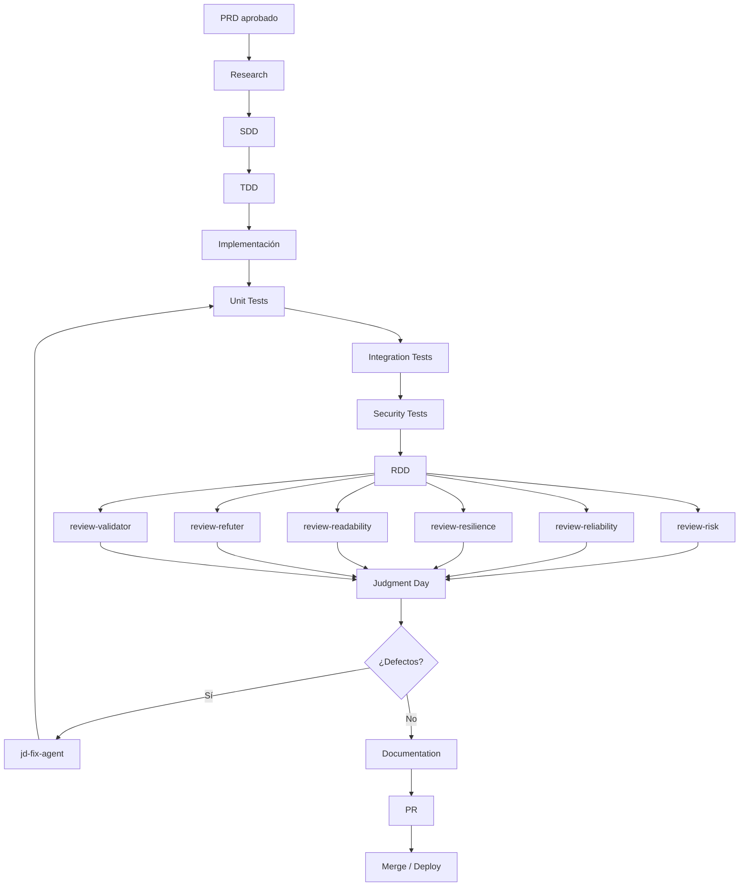

# Agent Diagrams — Agent Flow

**Source:** `gentle-meeting-documentation-agent.md`, section 36 (verbatim Mermaid extraction).

End-to-end agent loop: PRD → research → SDD → TDD → implementation → tests →
RDD → reviewers → Judgment Day → fix loop → documentation → PR → deploy.

