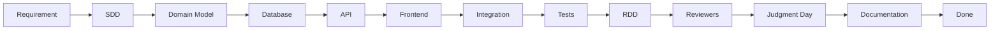

# Agent Diagrams — Per-Module Development Flow

**Source:** `gentle-meeting-documentation-agent.md`, section 37 (verbatim Mermaid extraction).

Linear lifecycle for a single module/feature: requirement → SDD → domain →
database → API → frontend → integration → tests → RDD → reviewers →
Judgment Day → documentation.

