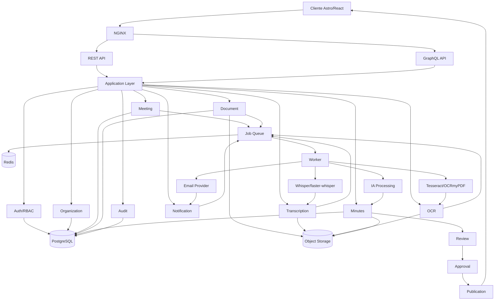

# Product Diagrams — Backend Flow

**Source:** `PRD-ReunionAI.md`, section 43 (verbatim Mermaid extraction).

Client → NGINX → REST/GraphQL → application modules → PostgreSQL, job queue,
workers (STT/OCR/AI/Email), and object storage; minutes end in the
review → approval → publication pipeline.

