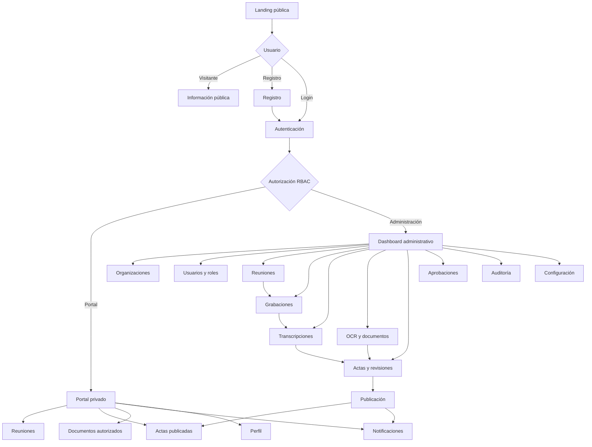

# Product Diagrams — Frontend Flow

**Source:** `PRD-ReunionAI.md`, section 42 (verbatim Mermaid extraction).

Landing → authentication → RBAC → Portal / Admin dashboards, including the
meeting → recording → transcription → minutes → publication chain.

