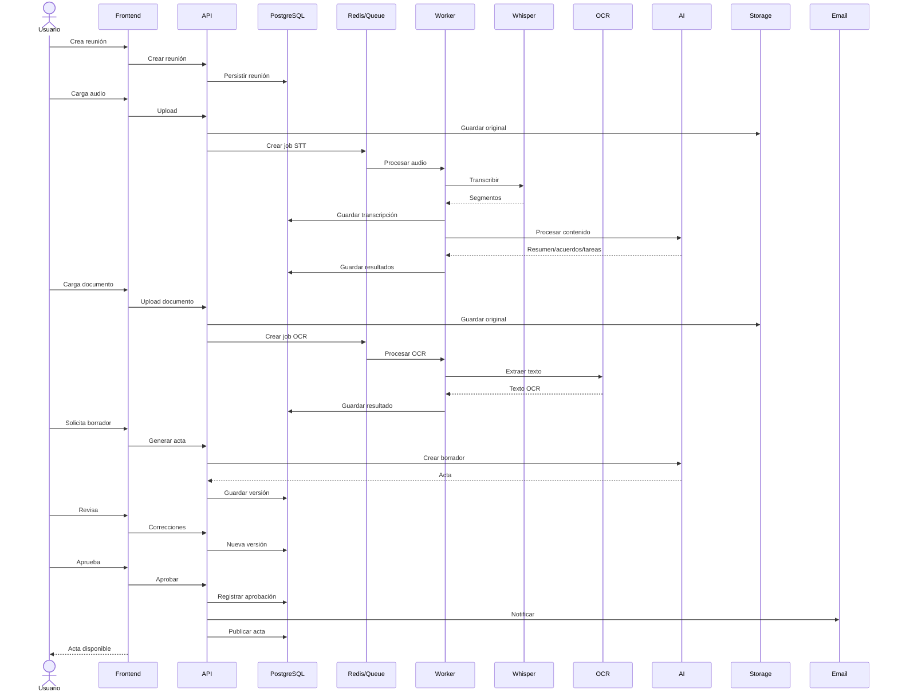

# Product Diagrams — Full Product Sequence

**Source:** `PRD-ReunionAI.md`, section 44 (verbatim Mermaid extraction).

End-to-end sequence: meeting creation, audio upload, STT job, AI processing,
document OCR, minutes drafting, human review, approval, notification, and
publication.

