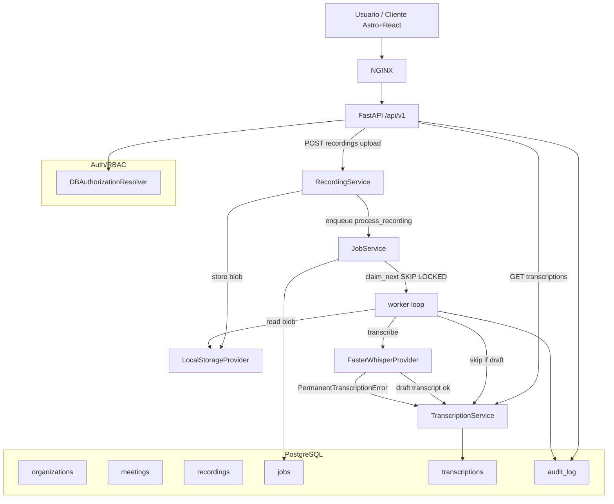

# Product Diagrams — Meetings/Transcription (MVP, implemented)

Product of the merged slices (PRs #37–86). **Current implementation** shown, not the PRD future target.

**Notas de la versión actual** (lineage RDD review-52fc6f3f172a0f56, aprobado):

- El worker precalienta el whisper via build arg en `Dockerfile.worker` (no depende de red en el primer job).
- `TRANSCRIBE_TIMEOUT_SECONDS` limita la llamada al provider.
- No hay diarización en el MVP (sólo texto como dato; quién dijo qué queda fuera del primer change).

