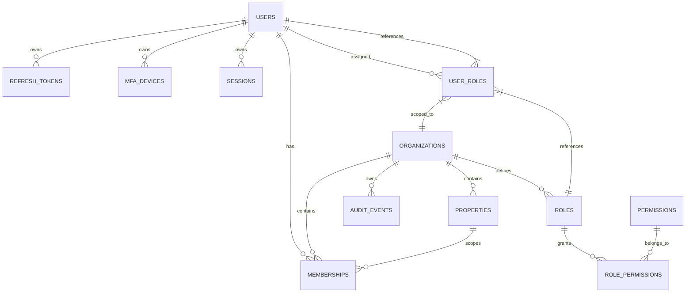

# Data Model: auth-multitenant-foundation

**Change ID:** `auth-multitenant-foundation`
**Status:** Design
**Date:** 2025-01-15

---

## 1. ERD Overview



**Key Principles:**

- Every tenant-scoped table has `tenant_id` (FK to `organizations.id`) + index.
- `users` is global (no `tenant_id`); tenancy via `memberships`.
- Soft delete via `deleted_at` on all entities except `refresh_tokens`, `mfa_devices`, `sessions`, `audit_events`.
- UUID v7 primary keys (fallback: `gen_random_uuid()`).
- `audit_events` is append-only; no UPDATE/DELETE.

---

## 2. Migration Sequence

### 2.1 Migration 001: `init_core`

**Tables:** `users`, `organizations`, `properties`, `memberships`

```sql
-- 001_init_core.sql
CREATE EXTENSION IF NOT EXISTS "uuid-ossp";
CREATE EXTENSION IF NOT EXISTS "pgcrypto"; -- for gen_random_uuid()

-- Users (global identity)
CREATE TABLE users (
    id UUID PRIMARY KEY DEFAULT gen_random_uuid(),
    email VARCHAR(255) NOT NULL,
    password_hash VARCHAR(255) NOT NULL,
    full_name VARCHAR(255),
    avatar_url VARCHAR(500),
    is_active BOOLEAN NOT NULL DEFAULT TRUE,
    is_super_admin BOOLEAN NOT NULL DEFAULT FALSE,
    mfa_enabled BOOLEAN NOT NULL DEFAULT FALSE,
    mfa_secret VARCHAR(255), -- base32 encoded TOTP secret
    last_login_at TIMESTAMPTZ,
    deleted_at TIMESTAMPTZ,
    created_at TIMESTAMPTZ NOT NULL DEFAULT now(),
    updated_at TIMESTAMPTZ NOT NULL DEFAULT now()
);

CREATE UNIQUE INDEX ux_users_email ON users (email) WHERE deleted_at IS NULL;
CREATE INDEX ix_users_is_active ON users (is_active);
CREATE INDEX ix_users_deleted_at ON users (deleted_at) WHERE deleted_at IS NOT NULL;

-- Organizations (tenant root)
CREATE TABLE organizations (
    id UUID PRIMARY KEY DEFAULT gen_random_uuid(),
    name VARCHAR(255) NOT NULL,
    slug VARCHAR(100) NOT NULL,
    description TEXT,
    settings JSONB NOT NULL DEFAULT '{}',
    deleted_at TIMESTAMPTZ,
    created_at TIMESTAMPTZ NOT NULL DEFAULT now(),
    updated_at TIMESTAMPTZ NOT NULL DEFAULT now()
);

CREATE UNIQUE INDEX ux_organizations_slug ON organizations (slug) WHERE deleted_at IS NULL;
CREATE INDEX ix_organizations_deleted_at ON organizations (deleted_at) WHERE deleted_at IS NOT NULL;

-- Properties/Groups (optional sub-tenant)
CREATE TABLE properties (
    id UUID PRIMARY KEY DEFAULT gen_random_uuid(),
    organization_id UUID NOT NULL REFERENCES organizations(id) ON DELETE CASCADE,
    name VARCHAR(255) NOT NULL,
    code VARCHAR(50),
    description TEXT,
    deleted_at TIMESTAMPTZ,
    created_at TIMESTAMPTZ NOT NULL DEFAULT now(),
    updated_at TIMESTAMPTZ NOT NULL DEFAULT now()
);

CREATE INDEX ix_properties_organization_id ON properties (organization_id);
CREATE UNIQUE INDEX ux_properties_org_code ON properties (organization_id, code) WHERE deleted_at IS NULL AND code IS NOT NULL;
CREATE INDEX ix_properties_deleted_at ON properties (deleted_at) WHERE deleted_at IS NOT NULL;

-- Memberships (user ↔ organization [↔ property])
CREATE TABLE memberships (
    id UUID PRIMARY KEY DEFAULT gen_random_uuid(),
    user_id UUID NOT NULL REFERENCES users(id) ON DELETE CASCADE,
    organization_id UUID NOT NULL REFERENCES organizations(id) ON DELETE CASCADE,
    property_id UUID REFERENCES properties(id) ON DELETE SET NULL,
    role VARCHAR(100) NOT NULL, -- role name (legacy, for migration; RBAC uses user_roles)
    is_active BOOLEAN NOT NULL DEFAULT TRUE,
    deleted_at TIMESTAMPTZ,
    created_at TIMESTAMPTZ NOT NULL DEFAULT now(),
    updated_at TIMESTAMPTZ NOT NULL DEFAULT now()
);

CREATE UNIQUE INDEX ux_memberships_user_org ON memberships (user_id, organization_id) WHERE deleted_at IS NULL;
CREATE INDEX ix_memberships_organization_id ON memberships (organization_id);
CREATE INDEX ix_memberships_property_id ON memberships (property_id);
CREATE INDEX ix_memberships_deleted_at ON memberships (deleted_at) WHERE deleted_at IS NOT NULL;
```

---

### 2.2 Migration 002: `auth`

**Tables:** `refresh_tokens`, `mfa_devices`, `sessions`

```sql
-- 002_auth.sql
-- Refresh tokens (rotating, hashed, chain-tracked)
CREATE TABLE refresh_tokens (
    id UUID PRIMARY KEY DEFAULT gen_random_uuid(),
    user_id UUID NOT NULL REFERENCES users(id) ON DELETE CASCADE,
    token_hash VARCHAR(255) NOT NULL, -- Argon2id hash
    expires_at TIMESTAMPTZ NOT NULL,
    revoked_at TIMESTAMPTZ,
    replaced_by_token_id UUID REFERENCES refresh_tokens(id) ON DELETE SET NULL,
    user_agent TEXT,
    ip INET,
    created_at TIMESTAMPTZ NOT NULL DEFAULT now()
);

CREATE UNIQUE INDEX ux_refresh_tokens_token_hash ON refresh_tokens (token_hash);
CREATE INDEX ix_refresh_tokens_user_id ON refresh_tokens (user_id);
CREATE INDEX ix_refresh_tokens_expires_at ON refresh_tokens (expires_at);
CREATE INDEX ix_refresh_tokens_revoked_at ON refresh_tokens (revoked_at) WHERE revoked_at IS NOT NULL;
CREATE INDEX ix_refresh_tokens_replaced_by ON refresh_tokens (replaced_by_token_id);

-- MFA Devices (TOTP)
CREATE TABLE mfa_devices (
    id UUID PRIMARY KEY DEFAULT gen_random_uuid(),
    user_id UUID NOT NULL REFERENCES users(id) ON DELETE CASCADE,
    name VARCHAR(100) NOT NULL, -- e.g., "Authenticator App", "Backup Codes"
    secret_encrypted VARCHAR(255) NOT NULL, -- encrypted TOTP secret
    is_primary BOOLEAN NOT NULL DEFAULT FALSE,
    last_used_at TIMESTAMPTZ,
    created_at TIMESTAMPTZ NOT NULL DEFAULT now()
);

CREATE UNIQUE INDEX ux_mfa_devices_user_name ON mfa_devices (user_id, name);
CREATE INDEX ix_mfa_devices_user_id ON mfa_devices (user_id);

-- Sessions (device tracking for revocation)
CREATE TABLE sessions (
    id UUID PRIMARY KEY DEFAULT gen_random_uuid(),
    user_id UUID NOT NULL REFERENCES users(id) ON DELETE CASCADE,
    refresh_token_id UUID NOT NULL REFERENCES refresh_tokens(id) ON DELETE CASCADE,
    user_agent TEXT,
    ip INET,
    last_activity_at TIMESTAMPTZ NOT NULL DEFAULT now(),
    created_at TIMESTAMPTZ NOT NULL DEFAULT now()
);

CREATE INDEX ix_sessions_user_id ON sessions (user_id);
CREATE INDEX ix_sessions_refresh_token_id ON sessions (refresh_token_id);
CREATE INDEX ix_sessions_last_activity ON sessions (last_activity_at);
```

---

### 2.3 Migration 003: `rbac`

**Tables:** `permissions`, `roles`, `role_permissions`, `user_roles`

```sql
-- 003_rbac.sql
-- Permission registry (resource.action)
CREATE TABLE permissions (
    id UUID PRIMARY KEY DEFAULT gen_random_uuid(),
    name VARCHAR(100) NOT NULL, -- e.g., "meeting.create", "user.read"
    resource VARCHAR(50) NOT NULL,
    action VARCHAR(50) NOT NULL,
    description TEXT,
    is_system BOOLEAN NOT NULL DEFAULT FALSE, -- system permissions cannot be deleted
    created_at TIMESTAMPTZ NOT NULL DEFAULT now()
);

CREATE UNIQUE INDEX ux_permissions_name ON permissions (name);
CREATE INDEX ix_permissions_resource ON permissions (resource);

-- Roles (base + custom)
CREATE TABLE roles (
    id UUID PRIMARY KEY DEFAULT gen_random_uuid(),
    organization_id UUID REFERENCES organizations(id) ON DELETE CASCADE, -- NULL = platform/base role
    name VARCHAR(100) NOT NULL,
    display_name VARCHAR(100) NOT NULL,
    description TEXT,
    is_system BOOLEAN NOT NULL DEFAULT FALSE, -- base roles are system
    is_deletable BOOLEAN NOT NULL DEFAULT TRUE, -- system roles not deletable
    created_at TIMESTAMPTZ NOT NULL DEFAULT now(),
    updated_at TIMESTAMPTZ NOT NULL DEFAULT now()
);

CREATE UNIQUE INDEX ux_roles_org_name ON roles (organization_id, name);
CREATE INDEX ix_roles_organization_id ON roles (organization_id);
CREATE INDEX ix_roles_is_system ON roles (is_system);

-- Role ↔ Permission (many-to-many)
CREATE TABLE role_permissions (
    role_id UUID NOT NULL REFERENCES roles(id) ON DELETE CASCADE,
    permission_id UUID NOT NULL REFERENCES permissions(id) ON DELETE CASCADE,
    created_at TIMESTAMPTZ NOT NULL DEFAULT now(),
    PRIMARY KEY (role_id, permission_id)
);

CREATE INDEX ix_role_permissions_permission_id ON role_permissions (permission_id);

-- User ↔ Role (scoped to tenant/organization)
CREATE TABLE user_roles (
    user_id UUID NOT NULL REFERENCES users(id) ON DELETE CASCADE,
    role_id UUID NOT NULL REFERENCES roles(id) ON DELETE CASCADE,
    organization_id UUID NOT NULL REFERENCES organizations(id) ON DELETE CASCADE,
    assigned_by UUID REFERENCES users(id) ON DELETE SET NULL,
    created_at TIMESTAMPTZ NOT NULL DEFAULT now(),
    PRIMARY KEY (user_id, role_id, organization_id)
);

CREATE INDEX ix_user_roles_user_id ON user_roles (user_id);
CREATE INDEX ix_user_roles_role_id ON user_roles (role_id);
CREATE INDEX ix_user_roles_organization_id ON user_roles (organization_id);
```

**Seed Data (in same migration, idempotent):**

```sql
-- Permissions (core set for MVP auth/org/rbac/audit)
INSERT INTO permissions (name, resource, action, description, is_system) VALUES
-- Auth
('auth.login', 'auth', 'login', 'Log in to the system', TRUE),
('auth.register', 'auth', 'register', 'Register a new organization', TRUE),
('auth.refresh', 'auth', 'refresh', 'Refresh access token', TRUE),
('auth.revoke', 'auth', 'revoke', 'Revoke own session', TRUE),
('auth.mfa.manage', 'auth', 'mfa.manage', 'Manage own MFA devices', TRUE),
-- Users
('user.read', 'user', 'read', 'Read users in tenant', TRUE),
('user.create', 'user', 'create', 'Create users in tenant', TRUE),
('user.update', 'user', 'update', 'Update users in tenant', TRUE),
('user.delete', 'user', 'delete', 'Soft-delete users in tenant', TRUE),
('user.password.change', 'user', 'password.change', 'Change own password', TRUE),
('user.session.read', 'user', 'session.read', 'List own sessions', TRUE),
('user.session.revoke', 'user', 'session.revoke', 'Revoke own sessions', TRUE),
('user.role.assign', 'user', 'role.assign', 'Assign roles to users', TRUE),
('user.role.revoke', 'user', 'role.revoke', 'Revoke roles from users', TRUE),
-- Organizations
('organization.read', 'organization', 'read', 'Read organization settings', TRUE),
('organization.create', 'organization', 'create', 'Create organizations (super-admin)', TRUE),
('organization.update', 'organization', 'update', 'Update organization settings', TRUE),
('organization.delete', 'organization', 'delete', 'Soft-delete organization', TRUE),
-- Properties
('property.read', 'property', 'read', 'Read properties in tenant', TRUE),
('property.create', 'property', 'create', 'Create properties in tenant', TRUE),
('property.update', 'property', 'update', 'Update properties in tenant', TRUE),
('property.delete', 'property', 'delete', 'Delete properties in tenant', TRUE),
-- Memberships
('membership.read', 'membership', 'read', 'List memberships in tenant', TRUE),
('membership.create', 'membership', 'create', 'Add members to tenant', TRUE),
('membership.update', 'membership', 'update', 'Update membership roles/properties', TRUE),
('membership.delete', 'membership', 'delete', 'Remove members from tenant', TRUE),
-- RBAC
('permission.read', 'permission', 'read', 'List permissions', TRUE),
('role.read', 'role', 'read', 'List roles in tenant', TRUE),
('role.create', 'role', 'create', 'Create custom roles in tenant', TRUE),
('role.update', 'role', 'update', 'Update custom roles in tenant', TRUE),
('role.delete', 'role', 'delete', 'Delete custom roles in tenant', TRUE),
('role.permission.assign', 'role', 'permission.assign', 'Assign permissions to roles', TRUE),
('role.permission.revoke', 'role', 'permission.revoke', 'Revoke permissions from roles', TRUE),
-- Audit
('audit.read', 'audit', 'read', 'Read audit log', TRUE)
ON CONFLICT (name) DO NOTHING;

-- Base Roles (10 per PRD §7)
-- Super Admin: platform-scoped, all permissions
INSERT INTO roles (id, organization_id, name, display_name, description, is_system, is_deletable)
VALUES (gen_random_uuid(), NULL, 'super_admin', 'Super Admin', 'Platform administrator with full access', TRUE, FALSE)
ON CONFLICT (organization_id, name) DO NOTHING;

-- Organization Admin: tenant-scoped, org/user/role/property/membership/audit management
INSERT INTO roles (id, organization_id, name, display_name, description, is_system, is_deletable)
VALUES (gen_random_uuid(), NULL, 'org_admin', 'Organization Admin', 'Organization administrator', TRUE, FALSE)
ON CONFLICT (organization_id, name) DO NOTHING;

-- Property Admin: tenant-scoped, scoped to property via membership
INSERT INTO roles (id, organization_id, name, display_name, description, is_system, is_deletable)
VALUES (gen_random_uuid(), NULL, 'property_admin', 'Property Admin', 'Property/group administrator', TRUE, FALSE)
ON CONFLICT (organization_id, name) DO NOTHING;

-- President
INSERT INTO roles (id, organization_id, name, display_name, description, is_system, is_deletable)
VALUES (gen_random_uuid(), NULL, 'president', 'President', 'Organization president', TRUE, FALSE)
ON CONFLICT (organization_id, name) DO NOTHING;

-- Secretary
INSERT INTO roles (id, organization_id, name, display_name, description, is_system, is_deletable)
VALUES (gen_random_uuid(), NULL, 'secretary', 'Secretary', 'Organization secretary', TRUE, FALSE)
ON CONFLICT (organization_id, name) DO NOTHING;

-- Board Member
INSERT INTO roles (id, organization_id, name, display_name, description, is_system, is_deletable)
VALUES (gen_random_uuid(), NULL, 'board_member', 'Board Member', 'Board member', TRUE, FALSE)
ON CONFLICT (organization_id, name) DO NOTHING;

-- Reviewer
INSERT INTO roles (id, organization_id, name, display_name, description, is_system, is_deletable)
VALUES (gen_random_uuid(), NULL, 'reviewer', 'Reviewer', 'Document/minutes reviewer', TRUE, FALSE)
ON CONFLICT (organization_id, name) DO NOTHING;

-- Co-owner
INSERT INTO roles (id, organization_id, name, display_name, description, is_system, is_deletable)
VALUES (gen_random_uuid(), NULL, 'co_owner', 'Co-owner', 'Co-owner/propietario', TRUE, FALSE)
ON CONFLICT (organization_id, name) DO NOTHING;

-- Resident
INSERT INTO roles (id, organization_id, name, display_name, description, is_system, is_deletable)
VALUES (gen_random_uuid(), NULL, 'resident', 'Resident', 'Resident/occupant', TRUE, FALSE)
ON CONFLICT (organization_id, name) DO NOTHING;

-- Guest
INSERT INTO roles (id, organization_id, name, display_name, description, is_system, is_deletable)
VALUES (gen_random_uuid(), NULL, 'guest', 'Guest', 'Guest with limited access', TRUE, FALSE)
ON CONFLICT (organization_id, name) DO NOTHING;

-- Role-Permission Assignments for Base Roles
-- Super Admin: all permissions (denoted by '*', resolved in code as wildcard)
-- For MVP, assign all seeded permissions explicitly:
INSERT INTO role_permissions (role_id, permission_id)
SELECT r.id, p.id FROM roles r, permissions p
WHERE r.name = 'super_admin' AND r.organization_id IS NULL
ON CONFLICT DO NOTHING;

-- Organization Admin permissions
INSERT INTO role_permissions (role_id, permission_id)
SELECT r.id, p.id FROM roles r, permissions p
WHERE r.name = 'org_admin' AND r.organization_id IS NULL
  AND p.name IN (
    'organization.read', 'organization.update',
    'user.read', 'user.create', 'user.update', 'user.delete',
    'user.password.change', 'user.session.read', 'user.session.revoke',
    'user.role.assign', 'user.role.revoke',
    'property.read', 'property.create', 'property.update', 'property.delete',
    'membership.read', 'membership.create', 'membership.update', 'membership.delete',
    'role.read', 'role.create', 'role.update', 'role.delete',
    'role.permission.assign', 'role.permission.revoke',
    'permission.read',
    'audit.read'
  )
ON CONFLICT DO NOTHING;

-- Property Admin permissions (scoped to property via membership)
INSERT INTO role_permissions (role_id, permission_id)
SELECT r.id, p.id FROM roles r, permissions p
WHERE r.name = 'property_admin' AND r.organization_id IS NULL
  AND p.name IN (
    'property.read', 'property.update',
    'membership.read', 'membership.update',
    'user.read', 'user.update',
    'audit.read'
  )
ON CONFLICT DO NOTHING;

-- President: org read, meetings, documents, minutes (future), audit read
INSERT INTO role_permissions (role_id, permission_id)
SELECT r.id, p.id FROM roles r, permissions p
WHERE r.name = 'president' AND r.organization_id IS NULL
  AND p.name IN (
    'organization.read', 'user.read', 'membership.read',
    'audit.read'
  )
ON CONFLICT DO NOTHING;

-- Secretary: org read, user read, minutes create/review (future), audit read
INSERT INTO role_permissions (role_id, permission_id)
SELECT r.id, p.id FROM roles r, permissions p
WHERE r.name = 'secretary' AND r.organization_id IS NULL
  AND p.name IN (
    'organization.read', 'user.read', 'membership.read',
    'audit.read'
  )
ON CONFLICT DO NOTHING;

-- Board Member: read-only org/user/meetings
INSERT INTO role_permissions (role_id, permission_id)
SELECT r.id, p.id FROM roles r, permissions p
WHERE r.name = 'board_member' AND r.organization_id IS NULL
  AND p.name IN (
    'organization.read', 'user.read', 'membership.read'
  )
ON CONFLICT DO NOTHING;

-- Reviewer: read + review permissions (future)
INSERT INTO role_permissions (role_id, permission_id)
SELECT r.id, p.id FROM roles r, permissions p
WHERE r.name = 'reviewer' AND r.organization_id IS NULL
  AND p.name IN (
    'organization.read', 'user.read', 'membership.read'
  )
ON CONFLICT DO NOTHING;

-- Co-owner: read org, user, membership
INSERT INTO role_permissions (role_id, permission_id)
SELECT r.id, p.id FROM roles r, permissions p
WHERE r.name = 'co_owner' AND r.organization_id IS NULL
  AND p.name IN (
    'organization.read', 'user.read', 'membership.read'
  )
ON CONFLICT DO NOTHING;

-- Resident: minimal read
INSERT INTO role_permissions (role_id, permission_id)
SELECT r.id, p.id FROM roles r, permissions p
WHERE r.name = 'resident' AND r.organization_id IS NULL
  AND p.name IN (
    'organization.read', 'user.read'
  )
ON CONFLICT DO NOTHING;

-- Guest: minimal read
INSERT INTO role_permissions (role_id, permission_id)
SELECT r.id, p.id FROM roles r, permissions p
WHERE r.name = 'guest' AND r.organization_id IS NULL
  AND p.name IN (
    'organization.read'
  )
ON CONFLICT DO NOTHING;
```

---

### 2.4 Migration 004: `audit`

**Table:** `audit_events`

```sql
-- 004_audit.sql
CREATE TABLE audit_events (
    id UUID PRIMARY KEY DEFAULT gen_random_uuid(),
    actor_user_id UUID NOT NULL REFERENCES users(id) ON DELETE RESTRICT,
    tenant_id UUID NOT NULL REFERENCES organizations(id) ON DELETE RESTRICT,
    action VARCHAR(100) NOT NULL, -- e.g., "user.login", "user.create", "role.permission.assign"
    resource VARCHAR(100) NOT NULL, -- e.g., "user", "role", "organization"
    resource_id UUID, -- nullable for collection actions
    timestamp TIMESTAMPTZ NOT NULL DEFAULT now(),
    ip INET,
    user_agent TEXT,
    metadata JSONB NOT NULL DEFAULT '{}'
);

-- Indexes for common query patterns
CREATE INDEX ix_audit_events_tenant_timestamp ON audit_events (tenant_id, timestamp DESC);
CREATE INDEX ix_audit_events_actor_timestamp ON audit_events (actor_user_id, timestamp DESC);
CREATE INDEX ix_audit_events_resource ON audit_events (resource, resource_id);
CREATE INDEX ix_audit_events_action ON audit_events (action);
CREATE INDEX ix_audit_events_timestamp ON audit_events (timestamp DESC);

-- Append-only enforcement: revoke UPDATE/DELETE from app role
-- Run as superuser after migration:
-- REVOKE UPDATE, DELETE ON audit_events FROM reunionai_app;
-- ALTER TABLE audit_events ENABLE ROW LEVEL SECURITY; -- optional, for future RLS
```

---

## 3. Complete Table Reference

| Table | Tenant-Scoped? | `tenant_id` Source | Soft Delete | PK | Key Indexes |
| ------- | ---------------- | ------------------- | ------------- | ----- | ------------- |
| `users` | No (global) | N/A | Yes (`deleted_at`) | `id` (UUID) | `ux_users_email`, `ix_users_is_active` |
| `organizations` | Self (root) | `id` | Yes | `id` | `ux_organizations_slug` |
| `properties` | Yes | `organization_id` | Yes | `id` | `ix_properties_organization_id`, `ux_properties_org_code` |
| `memberships` | Yes | `organization_id` | Yes | `id` | `ux_memberships_user_org`, `ix_memberships_organization_id`, `ix_memberships_property_id` |
| `refresh_tokens` | Via `user_id` → membership | N/A | No (hard delete on revoke) | `id` | `ux_refresh_tokens_token_hash`, `ix_refresh_tokens_user_id`, `ix_refresh_tokens_expires_at` |
| `mfa_devices` | Via `user_id` → membership | N/A | No | `id` | `ux_mfa_devices_user_name`, `ix_mfa_devices_user_id` |
| `sessions` | Via `user_id` → membership | N/A | No | `id` | `ix_sessions_user_id`, `ix_sessions_refresh_token_id` |
| `permissions` | No (global registry) | N/A | No | `id` | `ux_permissions_name` |
| `roles` | Yes (custom) / No (base) | `organization_id` (NULL for base) | No | `id` | `ux_roles_org_name`, `ix_roles_organization_id` |
| `role_permissions` | Via `role.organization_id` | N/A | No | Composite | `ix_role_permissions_permission_id` |
| `user_roles` | Yes | `organization_id` | No | Composite | `ix_user_roles_user_id`, `ix_user_roles_organization_id` |
| `audit_events` | Yes | `tenant_id` | **Never** | `id` | `ix_audit_events_tenant_timestamp`, `ix_audit_events_actor_timestamp`, `ix_audit_events_resource` |

---

## 4. Base Role Permission Matrices

### 4.1 Super Admin (Platform)

| Permission | Granted |
|------------|---------|
| `*` (all) | ✅ |
| Platform-level: create organizations, manage super-admins | ✅ |

### 4.2 Organization Admin (Tenant)

| Resource | Permissions |
| ---------- | ------------- |
| organization | read, update |
| user | read, create, update, delete, password.change, session.read, session.revoke, role.assign, role.revoke |
| property | read, create, update, delete |
| membership | read, create, update, delete |
| role | read, create, update, delete, permission.assign, permission.revoke |
| permission | read |
| audit | read |

### 4.3 Property Admin (Tenant + Property)

| Resource | Permissions |
| ---------- | ------------- |
| property | read, update |
| membership | read, update (within property) |
| user | read, update (within property) |
| audit | read |

### 4.4 President

| Resource | Permissions |
| ---------- | ------------- |
| organization | read |
| user | read |
| membership | read |
| audit | read |

### 4.5 Secretary

| Resource | Permissions |
| ---------- | ------------- |
| organization | read |
| user | read |
| membership | read |
| audit | read |

### 4.6 Board Member

| Resource | Permissions |
| ---------- | ------------- |
| organization | read |
| user | read |
| membership | read |

### 4.7 Reviewer

| Resource | Permissions |
| ---------- | ------------- |
| organization | read |
| user | read |
| membership | read |

### 4.8 Co-owner

| Resource | Permissions |
| ---------- | ------------- |
| organization | read |
| user | read |
| membership | read |

### 4.9 Resident

| Resource | Permissions |
|----------|-------------|
| organization | read |
| user | read |

### 4.10 Guest

| Resource | Permissions |
|----------|-------------|
| organization | read |

---

## 5. Constraint & Integrity Rules

1. **Email uniqueness:** Global, including soft-deleted users (partial unique index).
2. **Membership uniqueness:** One active membership per user per organization.
3. **Role uniqueness:** One role per name per organization (base roles have `organization_id=NULL`).
4. **User-Role uniqueness:** One assignment per user-role-org triplet.
5. **Refresh token chain:** `replaced_by_token_id` self-referential FK ensures chain integrity.
6. **Audit append-only:** `REVOKE UPDATE, DELETE` on `audit_events` for app role; ORM has no mutating methods.
7. **Cascade deletes:**
   - `organization` delete → cascades to `properties`, `memberships`, `roles` (custom), `audit_events` (RESTRICT on audit).
   - `user` delete → cascades to `refresh_tokens`, `mfa_devices`, `sessions`, `memberships`, `user_roles`.
   - `property` delete → sets `memberships.property_id = NULL`.
8. **Soft delete semantics:** `deleted_at IS NULL` = active. All queries filter `WHERE deleted_at IS NULL` unless explicitly including deleted.

---

## 6. Migration Commands

```bash
# Generate migration
alembic revision --autogenerate -m "001_init_core"
alembic revision --autogenerate -m "002_auth"
alembic revision --autogenerate -m "003_rbac"
alembic revision --autogenerate -m "004_audit"

# Apply
alembic upgrade head

# Rollback (tested in CI)
alembic downgrade -1
alembic downgrade base
```

---

## 7. Notes for Future Extensions

- **Meeting/Recording/Transcription tables:** Add in future migrations with `tenant_id` (FK to organizations) + indexes.
- **Document/OCR/Minutes tables:** Same pattern.
- **RLS policies:** Can be added later referencing `current_setting('app.current_tenant_id')` without schema changes.
- **UUID v7:** If `uuid-ossp` provides `uuid_generate_v7()`, switch default; otherwise `gen_random_uuid()` is fine.
