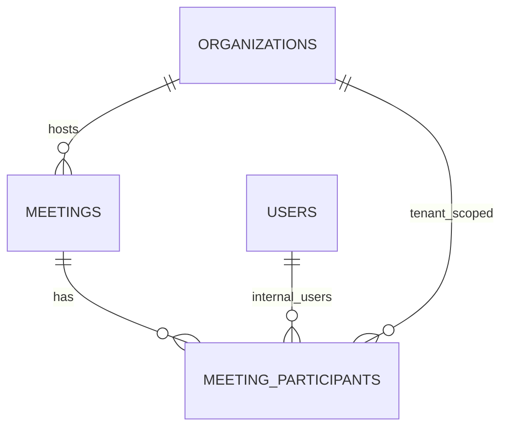

# Data Model: meetings-crud

**Change ID:** `meetings-crud`
**Status:** Design
**Date:** 2025-01-20

---

## 1. ERD Overview



**Key Principles:**

- Every tenant-scoped table has `tenant_id` (FK to `organizations.id`) + index.
- `meetings.tenant_id` references `organizations.id`; soft-delete via `deleted_at`.
- `meeting_participants` uses composite PK + unique constraints for (tenant_id, user_id) and (tenant_id, email).
- Soft delete via `deleted_at` on both `meetings` and `meeting_participants`.
- UUID v7 primary keys (fallback: `gen_random_uuid()`).
- UTC storage for all timestamps; `America/Bogota` at API edges only.

---

## 2. SQL Definitions

### 2.1 Migration: `005_meetings` (new migration, follows 004_audit)

```sql
-- 005_meetings.sql
-- Meets table

CREATE TABLE meetings (
    id UUID PRIMARY KEY DEFAULT gen_random_uuid(),
    title VARCHAR(255) NOT NULL,
    description TEXT,
    scheduled_at TIMESTAMPTZ NOT NULL,
    start_at TIMESTAMPTZ NOT NULL,
    end_at TIMESTAMPTZ NOT NULL,
    location VARCHAR(500),
    modality VARCHAR(20) NOT NULL DEFAULT 'in_person',
    status VARCHAR(20) NOT NULL DEFAULT 'scheduled',
    tenant_id UUID NOT NULL REFERENCES organizations(id) ON DELETE RESTRICT,
    deleted_at TIMESTAMPTZ,
    created_at TIMESTAMPTZ NOT NULL DEFAULT now(),
    updated_at TIMESTAMPTZ NOT NULL DEFAULT now()
);

-- Indexes for tenant-scoped queries
CREATE INDEX ix_meetings_tenant_id ON meetings (tenant_id);
CREATE INDEX ix_meetings_tenant_status ON meetings (tenant_id, status);
CREATE INDEX ix_meetings_scheduled_at ON meetings (scheduled_at);
CREATE INDEX ix_meetings_deleted_at ON meetings (deleted_at) WHERE deleted_at IS NOT NULL;

-- Check constraint: valid modality
ALTER TABLE meetings ADD CONSTRAINT chk_meetings_modality
    CHECK (modality IN ('in_person', 'virtual', 'hybrid'));

-- Check constraint: valid status
ALTER TABLE meetings ADD CONSTRAINT chk_meetings_status
    CHECK (status IN ('scheduled', 'in_progress', 'finished', 'cancelled'));

-- Comment: all timestamps stored as UTC; convert America/Bogota at edges only
```

---

### 2.2 Migration: `006_meeting_participants` (new migration, follows 005_meetings)

```sql
-- 006_meeting_participants.sql

CREATE TABLE meeting_participants (
    id UUID PRIMARY KEY DEFAULT gen_random_uuid(),
    meeting_id UUID NOT NULL REFERENCES meetings(id) ON DELETE CASCADE,
    tenant_id UUID NOT NULL REFERENCES organizations(id) ON DELETE RESTRICT,
    user_id UUID REFERENCES users(id) ON DELETE RESTRICT,
    email VARCHAR(255),
    role VARCHAR(20) NOT NULL DEFAULT 'attendee',
    status VARCHAR(10) NOT NULL DEFAULT 'active',
    deleted_at TIMESTAMPTZ,
    created_at TIMESTAMPTZ NOT NULL DEFAULT now(),
    -- Constraint: exactly one of user_id or email (internal or external, not both)
    CONSTRAINT chk_meeting_participants_user_or_email
        CHECK ((user_id IS NOT NULL AND email IS NULL) OR (user_id IS NULL AND email IS NOT NULL)),
    -- Constraint: valid role
    CONSTRAINT chk_meeting_participants_role
        CHECK (role IN ('organizer', 'presenter', 'attendee')),
    -- Constraint: valid status
    CONSTRAINT chk_meeting_participants_status
        CHECK (status IN ('active', 'removed'))
);

-- Unique constraint: one internal user per meeting (tenant_id + user_id)
CREATE UNIQUE INDEX ux_meeting_participants_tenant_user
    ON meeting_participants (tenant_id, user_id)
    WHERE user_id IS NOT NULL;

-- Unique constraint: one external email per meeting (tenant_id + email)
CREATE UNIQUE INDEX ux_meeting_participants_tenant_email
    ON meeting_participants (tenant_id, email)
    WHERE email IS NOT NULL;

-- Index: tenant + meeting for join efficiency
CREATE INDEX ix_meeting_participants_tenant_meeting
    ON meeting_participants (tenant_id, meeting_id);

-- Index: meeting + role for role-based queries
CREATE INDEX ix_meeting_participants_meeting_role
    ON meeting_participants (meeting_id, role);

-- Index: tenant + meeting (covering for list queries)
CREATE INDEX ix_meeting_participants_tenant_date
    ON meeting_participants (tenant_id, meeting_id);

-- Index: deleted_at for soft-delete queries
CREATE INDEX ix_meeting_participants_deleted_at
    ON meeting_participants (deleted_at)
    WHERE deleted_at IS NOT NULL;

-- Comment: tenant_id is redundant but stored for join efficiency and query simplicity;
-- always equals meetings.tenant_id for the same meeting_id; never trusted from client.
```

---

## 3. Complete Table Reference

| Table | Tenant-Scoped? | `tenant_id` Source | Soft Delete | PK | Key Indexes | Unique Constraints | FKs |
| ------- | ---------------- | ------------------- | ------------- | ----- | ------------- | ------------------- | ----- |
| `meetings` | Yes | `organizations.id` (via membership) | Yes (`deleted_at`) | `id` (UUID) | `ix_meetings_tenant_id`, `ix_meetings_tenant_status`, `ix_meetings_scheduled_at`, `ix_meetings_deleted_at` | `chk_meetings_modality`, `chk_meetings_status` | `meetings.tenant_id → organizations.id` (RESTRICT) |
| `meeting_participants` | Yes | Redundant (from meeting + membership) | Yes (`deleted_at`) | `id` (UUID) | `ix_meeting_participants_tenant_meeting`, `ix_meeting_participants_meeting_role`, `ix_meeting_participants_tenant_date`, `ix_meeting_participants_deleted_at` | `uq_meeting_participants_tenant_user`, `uq_meeting_participants_tenant_email`, `uq_meeting_participants_meeting_role_user`, `uq_meeting_participants_meeting_email` | `meeting_participants.meeting_id → meetings.id` (CASCADE)<br>`meeting_participants.user_id → users.id` (RESTRICT)<br>`meeting_participants.tenant_id → organizations.id` (RESTRICT) |
| `users` | No (global) | N/A | Yes (`deleted_at`) | `id` (UUID) | See `auth-multitenant-foundation` data-model | See `auth-multitenant-foundation` data-model | — |

---

## 4. Dependency Rules (Enforced)

| From → To | Reason |
| ----------|--------|
| `meetings → core` | Database engine, dependencies (get_tenant_id, require_permission) |
| `meetings → organizations` | `tenant_id` FK → `organizations.id`; read org name/slug for response |
| `meetings → rbac` | `require_permission("meeting.create/read/update/cancel/participant_manage")` |
| `meetings → audit` | Auto-audit middleware; explicit `AuditEvent` records on mutate |
| `meeting_participants → meetings` | FK `meeting_id`; cascade on meeting soft-delete |
| `meeting_participants → users` | FK `user_id`; restrict on user delete if participants exist |
| `meeting_participants → organizations` | `tenant_id` FK; consistent scoping |
| `meetings ↔ users` | Many-to-many via `meeting_participants`; no direct FK from users to meetings |
| **Never:** `meetings → auth`, `meetings ↔ users` (direct) | Cross-module via `core.dependencies` only |

**Critical invariant:** All meetings queries auto-inject `.filter(tenant_id=get_tenant_id())` via `TenantScopedRepository`. No endpoint accepts `tenant_id` from the client.

---

## 5. Timezone Design (Summary from architecture.md §2.4)

- **DB column:** `scheduled_at`, `start_at`, `end_at` — TIMESTAMPTZ, **always stored as UTC**.
- **Input:** ISO 8601 with offset, accepted at API edges. Client sends America/Bogota local time; server converts to UTC before storing.
- **Output:** ISO 8601 UTC in API responses (e.g., `2025-01-20T14:30:00Z`). Client formats to America/Bogota for display.
- **Rationale:** Store once, convert anywhere. Avoids timezone ambiguity, DST transitions, and cross-regional comparison bugs.

---

## 6. Open Questions

- [ ] None. All decisions traced to proposal, specs, and foundation conventions.